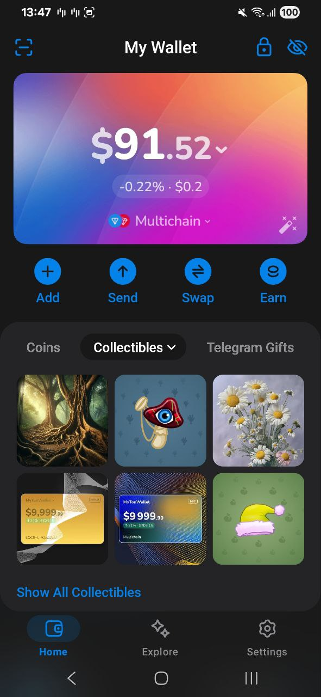

# :gem: MyTonWallet Air :gem:

**The most feature-rich web wallet and browser extension for the [TON Network](https://ton.org)** –
with support of jettons, NFT, TON DNS, TON Sites, TON Proxy, and TON Magic. **Now on the Air!**



## :beers: How to Build

After cloning the Air repository, follow the build instructions and run:

```
cp .env.example .env
npm install
npm run build
npm run mobile:build
```

Then add these two lines into `capacitor.build.gradle` file: (lines 32, 33)

```
implementation project(':air:SubModules:AirAsFramework')
debugImplementation libs.leakcanary.android
```
And build the project (`mobile/android` dir) with Android
Studio as you normally do. Happy Coding! :)

If you've modified SDK files (src/api/*), please run the SDK file generator command:

```
npm run build:air
```

This command will generate the js file required in the Air applications and place it in the project
directory automatically.

## SubModules

The Air application is splitted into many ui and logic submodules.

You can get a summary for submodules [here](docs/submodules.md).

## Blockchain Communications

All the api calls and blockchain logic is shared with our long-lived stable production webapp,
through a js bridge. The native app is developed around that SDK.

To learn more about this bridge, read [this doc](docs/js-bridge.md).

## Storage

### Shared Storages:

* GlobalStorage

  Global storage stores all the non-critical data, including cached activities, settings and so on.

  It stores data in the web-view local-storage on both Legacy(Capacitor) app and the new Air(Native)
  app.

* SecureStorage

  Sensitive encrypted data are stored using this storage, into SharedPreferences.
